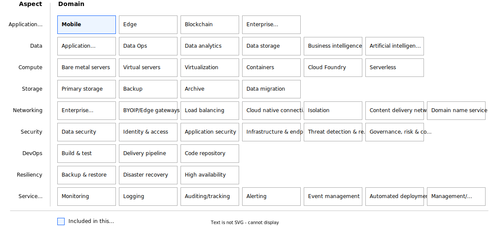

---

copyright:
  years: 2022, 2023
lastupdated: "2024-08-27"
keywords:
subcollection: architecture-framework

---

{{site.data.keyword.attribute-definition-list}}

# {{site.data.keyword.arch_framework}} aspects and domains
{: #taxonomy}

Technology taxonomy of aspects and domains can be applied to develop end-to-end platform or application architectures on any cloud provider. Enterprise Cloud Solutions need to address requirements across the various aspects and domains.
{: shortdesc}

{: caption="Figure 1. {{site.data.keyword.arch_framework}} heat map" caption-side="bottom"}

## Aspects
{: #aspects}

The Aspects are shown in column 1 and cover the different layers of the solution stack, from IT infrastructure through the application, as well as nonfunctional requirements and operational aspects.

The application platform aspect includes some of the application workload types and can be extended to include additional workloads. The Data aspect covers common application data requirements.

Most of the aspects, like Compute, Storage, Networking, Security, and Resiliency are self-explanatory because they describe either the IT environment or common nonfunctional requirements that are table stakes for any enterprise solution.

The DevOps and Service Management cover the operational aspects of the solution.

## Domains
{: #domains}

Domains are the capabilities or functions within an aspect. For example, within the Security aspect, Data Security, Identity and Access Management, and Application Security are examples of functions that are contained in that aspect.

Each domain then contains a set of component options available to meet solution requirements.

## Components
{: #components}

The component options for each domain are determined by the target cloud deployment model and cloud service provider under consideration.

Components are products or technology choices that satisfy the requirements for a specific category. Component options are determined by the target cloud service provider.

## Example taxonomy
{: #example}

The following are examples of cloud deployments and cloud service providers.

Cloud deployment model
    : Public, Private, Hybrid, Multi-Cloud, Distributed Cloud

Cloud platform
    : IBM Cloud, AWS, Azure, GCP, other cloud

The following table illustrates component options for the Containers domain across various Public Cloud Service Providers. Note that this is just a sample and not a comprehensive list of available services on each cloud provider. How to make component architecture decisions for your solution is covered in [Designing a cloud solution by using the {{site.data.keyword.arch_framework}}](/docs/architecture-framework?topic=architecture-framework-create-solution).

| Aspect             | Domain             | IBM Cloud       | AWS         | Azure       | Google Cloud Platform |
|--------------------|--------------------|-----------------|-------------|-------------|-------------|
| Compute            | Containers         |IBM Kubernetes Service  \n Red Hat OpenShift on IBM Cloud| Elastic Kubernetes Service  \n Elastic Container Service  \n Red Hat OpenShift on AWS| Azure Kubernetes Service  \n Azure Red Hat OpenShift | Google Kubernetes Engine  \n Red Hat OpenShift on GCP|
{: caption="Table 1. Component options for Containers domain across various Public Cloud Service Providers" caption-side="bottom"}
