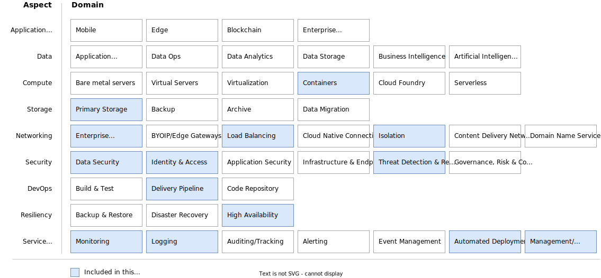

---

copyright:
  years: 2022
lastupdated: "2022-10-12"
keywords: 
subcollection: architecture-framework

---

{{site.data.keyword.attribute-definition-list}}

# Creating a design requirements heat map image
{: #heat-map}

The solution architecture heat map is based on the architecture framework and is used to identify the requirements and capabilities and drive the architecture decisions for the solution.
{: shortdesc}

A template of the heat map is available and can be updated in draw.io. The values in the heat map are intended to be the same from architecture to architecture. You update the template to highlight which components apply to your architecture.

The aspects and domains of the architecture framework can be used as a guide to clarify requirements and determine which domains will be utilized for any solution. Some example questions that will determine the domains for which you need to make component choices are:

- Do you have requirements for Security, including Network, Data, or Identity and Access Management?
- What are your Resiliency requirements, including Backup, Disaster Recovery and High Availability? What are the SLA, RTO/RPO requirements?
- What are your connectivity (Network) requirements? Is dedicated, private connectivity back to your enterprise needed? Is the solution multi-tier? If high availability is needed, will you need a load balancing capability?

Your requirements will determine the domains applicable to the solution and drive the component choices.

The solution architecture heat map provides an at-a-glance view of the domains mapped to your solution requirements. The following figure illustrates an example of the aspects and domains associated with common requirements for containerized workloads deployed on a hybrid, multi-cloud environment. For each of the domains highlighted in the solution architecture heat map you will document the architecture decision needs.

{: caption="Figure 1. Example heat map" caption-side="bottom"}

## Using the heat map template
{: #update-heat-map}

1. Download the template from https://github.com/ibm-cloud-docs/architecture-framework/blob/master/templates/heat-map-template.drawio.
2. Open the template in draw.io.
3. Apply the "included" styling for all components that are part of your architecture. In the template, the **Mobile** box has the styling of an included component.
   
   1. Select the **Mobile** box.
   2. Go to the **Style** tab and select **Copy Style**.
   3. Select the component box that's included in your architecture.
   4. Go to the **Style** tab and select **Paste Style**.
   5. If Mobile is not part of your architecture, copy the style from an unselected box and paste it into the mobile box.

4. Save and export the image as an SVG file.
