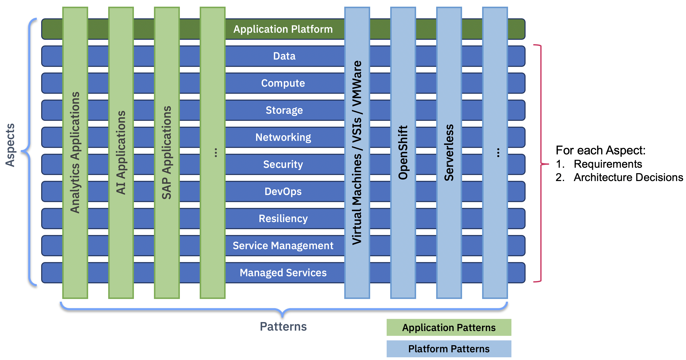

---

copyright:
  years: 2023
lastupdated: "2023-01-06"
keywords: 
subcollection: architecture-framework

---

{{site.data.keyword.attribute-definition-list}}

# Introduction to the architecture framework
{: #intro}

The architecture framework is a structured, technology agnostic, enterprise architecture approach, inspired by the technology layer of the [TOGAF](https://www.opengroup.org/togaf) model. It can be used as a guide to provide a consistent approach to architect hybrid, multi-cloud end-to-end solutions based on your requirements.
{: shortdesc}

## Hierarchy of the architecture framework
{: #heirarchy}

The architecture framework defines a technology- and cloud-provider-agnostic taxonomy of "aspects" and "domains" that can be used to develop reference solutions or patterns for specific platforms or applications on any target cloud deployment, be it private cloud, public cloud, hybrid cloud, or multi-cloud.

Pattern
    : A pattern is a combination of fit-for-purpose components across one or more categories and technologies to meet specific enterprise requirements for cloud workloads.

Aspect
    : Aspects are architectural areas that need to be considered for any enterprise solution. Some aspects are associated with non-functional requirements like security and resiliency. Each aspect can have one or more domains.

Domain
    : Domains are common capabilities or similar technology functions within an aspect. For example, Enterprise Connectivity and Load Balancers are considered networking technologies.

Component
    : Components are product offerings that can be used to satisfy the solution requirements. The component options depend on the target cloud deployment and cloud provider. For example, Direct Link 2.0 and VPC VPN Gateways are Enterprise Connectivity components on the IBM Cloud.

## Cloud solutions
{: #cloud-solutions}

Cloud solutions cross many aspects. And for each aspect there are requirements and architecture decisions that need to be assessed. 

{: caption="Figure 1. Cloud solutions cross many aspects" caption-side="bottom"}
